 

  
  

  
  

---

## 👩‍💻 About Me

Hi! I'm **Sakshi Prajapati**, a BCA student and aspiring **Full Stack Web Developer** who enjoys turning ideas into responsive and interactive web applications.

* 🔭 Currently building projects with **React, Next.js, Node.js & MongoDB**
* 🌱 Learning advanced **full-stack development, debugging & UI/UX**
* 💻 Interested in building **clean, responsive and scalable web applications**
* 🚀 Exploring modern development and deployment workflows
* 🤝 Open to collaborating on interesting **frontend & full-stack projects**
* 💬 Ask me about **React, Next.js, JavaScript, Tailwind CSS & project structure**
* ⚡ Fun fact: I really like clean, structured and minimal UI designs.

---

## 🛠️ Tech Stack

### 💻 Frontend

### ⚙️ Backend & Database

### 🔧 Tools & Technologies

---

## 🚀 Featured Projects

### 🧠 Memories — Image Sharing Platform

A full-stack social image-sharing application where users can create posts, interact with content and manage their profiles.

**Tech:** React • Node.js • Express.js • MongoDB • Cloudinary

---

### 🛒 Shopping Cart

A responsive e-commerce shopping cart application built with React, focusing on reusable components and interactive UI.

**Tech:** React • JavaScript • CSS

---

### ✈️ Travel Package Explorer

A responsive travel exploration website for browsing destinations and travel packages with a modern user interface.

**Tech:** React • JavaScript • Responsive UI

---

## 📊 GitHub Statistics

  

  

---

## 📈 GitHub Activity

My full contribution calendar and recent activity are available on my [GitHub profile](https://github.com/prajapatisakshi696-cmd).

---

## 🌐 Let's Connect

---

### ✨ Code. Learn. Build. Repeat. 🚀

**Thanks for visiting my profile! ❤️**

